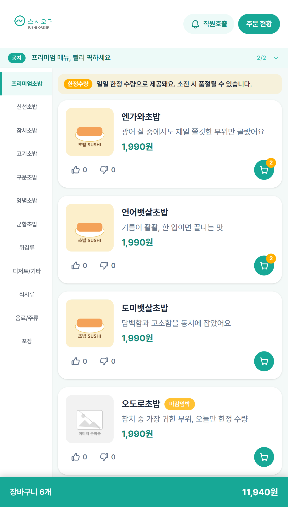
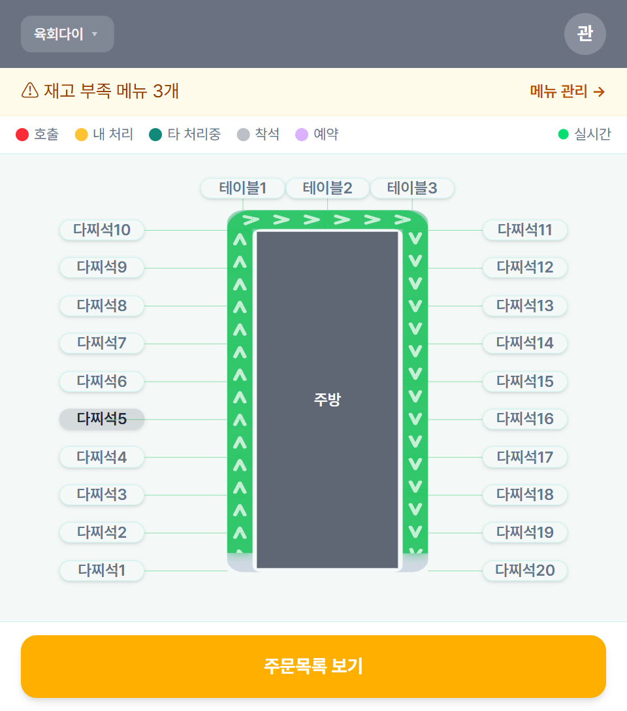

# 🍣 sushiorder — 식당 QR 주문 시스템

주말에 스시집에서 직접 일하며 겪은 **주문 전달 과정의 비효율**(홀 직원이 주문을 받아 주방에 구두/수기로 전달하는 과정에서의 누락·지연)을 해결하기 위해, 기획부터 배포까지 직접 진행한 개인 프로젝트입니다.

손님이 테이블의 QR을 스캔해 주문하면, 주문이 주방 디스플레이(KDS)까지 **유실 없이** 전달되는 것을 목표로 설계했습니다.

## 핵심 기능

- **QR 주문**: 테이블 QR 스캔 → 세션 토큰 발급 → 테이블 단위로 격리된 주문 세션
- **주방 디스플레이(KDS)**: 접수된 주문을 실시간 표시, 조리 상태 관리
- **관리자/직원 화면**: 메뉴 관리, 테이블 관리, 주문 현황 조회

## 아키텍처

```
[고객 QR 주문 (React, 별도 저장소)]
        │ REST API
        ▼
[Spring Boot 3 API 서버]
        │
        ├─ 주문 저장 (MariaDB) ── 상태 변경의 단일 진실 공급원(source of truth)
        │
        ▼
[STOMP WebSocket 브로드캐스트] → /topic/staff/orders → KDS/직원 화면 실시간 반영
```

### 설계에서 신경 쓴 부분

**1. 주문 정합성 — "주문 상태는 DB와 항상 일치해야 한다"**

주문 접수/확정/완료/취소는 모두 하나의 트랜잭션 안에서 **DB에 먼저 반영**된 뒤, 같은 흐름에서 STOMP로 KDS/직원 화면에 브로드캐스트됩니다. DB가 상태의 단일 진실 공급원이라, 화면이 새로고침되거나 WebSocket이 재연결돼도 REST 조회로 항상 최신 상태를 다시 받아올 수 있습니다.

- **중복 주문 방지**: 클라이언트가 보낸 `idempotencyKey`로 같은 요청이 중복 도착해도 기존 주문을 그대로 반환 (`OrderService.placeOrder`)
- **동시 접수/재고 충돌 처리**: 재고 차감 시 `Menu` 엔티티에 `@Version` 낙관적 락을 걸고, 충돌 시 `@Retryable`(최대 10회, 랜덤 backoff)로 자동 재시도 — 그래도 실패하면 `@Recover`가 해당 주문(또는 station 담당분)을 자동 취소 처리 후 브로드캐스트
- **감사 로그**: 주문 접수/확정/완료/취소 전 과정을 AOP 기반 `AuditLog`로 기록해 사후 추적 가능

> 인메모리 큐·DelayQueue 기반 재시도·Dead Letter Queue·서버 재기동 시 미전달 주문 복구 같은 별도의 비동기 전달 계층은 **아직 구현돼 있지 않습니다.** 현재는 DB 커밋 후 동기적으로 WebSocket을 브로드캐스트하는 구조이며, 향후 개선 과제로 남겨두고 있습니다.

**2. QR 주문 보안 — 테이블 단위 세션 격리**

QR URL만 알면 아무나 다른 테이블로 주문할 수 있는 문제를 막기 위해, QR 접근 시 **테이블 단위 세션 토큰**을 발급하고 주문 API는 토큰 검증을 거치도록 설계했습니다.

**3. 배포 — 컨테이너 기반 배포 사이클 직접 구성**

- API 서버·프론트엔드·DB를 각각 **Docker 컨테이너화**
- **Kubernetes**(Docker Desktop 내장 클러스터)에 배포, **nginx Ingress**로 라우팅 구성
  - API와 정적 리소스의 rewrite 충돌 문제를 Ingress 리소스 분리로 해결
- 초기 데이터(`data.sql`)가 재배포 시 중복 적재되지 않도록 멱등성 처리

## 기술 스택

| 구분 | 기술 |
|---|---|
| Backend | Java 21, Spring Boot 3, Spring Data JPA |
| Database | MariaDB |
| Frontend | React, Vite (별도 저장소 — 이 레포에는 백엔드만 포함) |
| Infra | Docker, Kubernetes, nginx Ingress |

## 실행 방법

이 저장소는 **백엔드(API 서버)만** 포함합니다. 프론트엔드 없이도 Swagger UI와 Postman으로 전체 API를 확인할 수 있습니다.

```bash
# 1. 저장소 클론
git clone https://github.com/JoonOh-Lee/sushiorder.git
cd sushiorder

# 2. 로컬 설정 파일 준비 (최초 1회만)
cp src/main/resources/application.properties.example src/main/resources/application.properties
cp .env.example .env
# 기본값(DB_PASSWORD=1234, JWT_SECRET=changeme-...) 그대로도 로컬 실행은 가능합니다.
# 운영 배포 시에는 반드시 실제 값으로 교체하세요 (application-prod.properties.example 참고).

# 3. Docker Compose로 로컬 실행
docker compose up --build

# 4. 접속
# REST API 베이스:  http://localhost:8080/api/v1
# Swagger UI:       http://localhost:8080/swagger-ui/index.html
# 데모 로그인:       POST /api/v1/auth/login  { "username": "admin", "password": "admin1234" }
# Postman 컬렉션:    postman/sushiorder.postman_collection.json (+ *_environment.json) import
```

Kubernetes로 띄우려면 `k8s/secret.example.yaml`을 복사해 `k8s/secret.yaml`(gitignore됨)에 실제 값을 채운 뒤 `kubectl apply -f k8s/secret.yaml -f k8s/db-deployment.yaml -f k8s/api-deployment.yaml -f k8s/ingress.yaml` 순서로 적용하세요.

## 화면

아래 경로에 이미지 파일을 추가하면 자동으로 표시됩니다.

| 고객 주문 | 주방 디스플레이(KDS) |
|---|---|
|  |  |

---

## 만들면서 배운 것

- **"동작하는 기능"과 "장애 상황에도 데이터가 어긋나지 않는 기능"의 차이.** 정상 흐름 구현보다 실패 시나리오(동시 주문/재고 충돌, 중복 요청, 재시도 한계 초과 시 자동 취소)를 설계하는 데 더 많은 시간을 썼습니다.
- 실무(SI)에서 다루지 못한 Spring Boot 3, JPA, Kubernetes를 학습에서 끝내지 않고 실제 동작하는 서비스로 검증했습니다.
